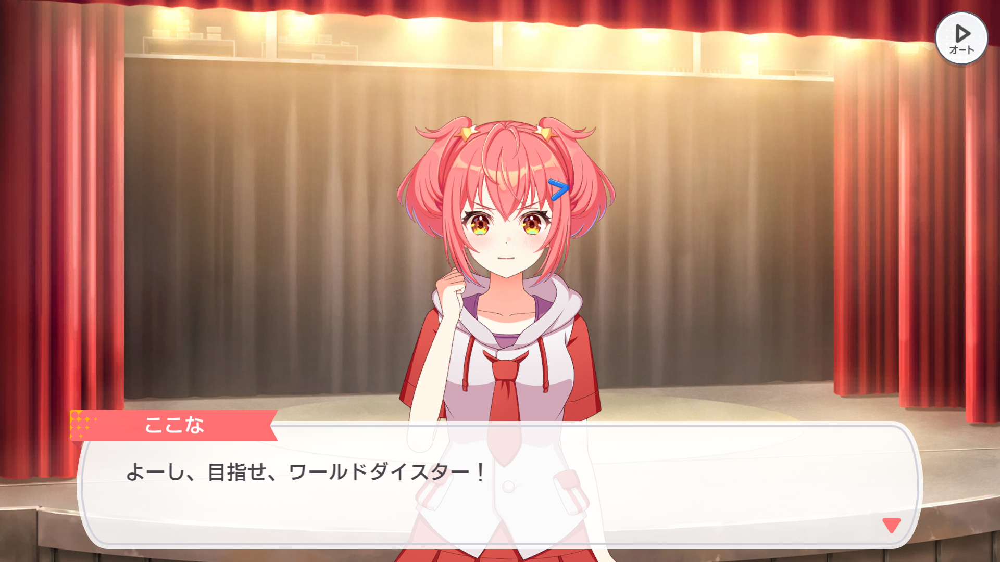

<div align="center">
  
  <hr>
</div>

<div align="center">
  
  
  
  
</div>

## About
A self-made adventure Player to render the stories for game [ワールドダイスター 夢のステラリウム](https://world-dai-star.com/game).

## Demo
[Online Demo](https://cpk0521.github.io/WDS_Adv_Player/?id=1000000)

## URL Parameters

| Parameters  | description | value |
| :-------------: | :-------------: | :-------------:|
|id  | Story Id | |
|tl  | Translate language | [#](https://github.com/Cpk0521/WDS_Adv_Player?tab=readme-ov-file#translation) |
|at  | Lock in Auto play Mode | true |
|renderer  | Renderer Type | `webgl`, `webgpu` |

Example : 
 - `https://cpk0521.github.io/WDS_Adv_Player/?id=1000000`
 - `https://cpk0521.github.io/WDS_Adv_Player/?id=2006008&tl=zhai`
 - `https://cpk0521.github.io/WDS_Adv_Player/?renderer=webgl`
 - `https://cpk0521.github.io/WDS_Adv_Player/?at=true`

## Translation

Currently supported languages :
  - `zhcn` - [DreamGallery/WDS-Translation-Csv](https://github.com/DreamGallery/WDS-Translation-Csv)
  - `zhcnai` - [huang207/WDS-Translation-Csv](https://github.com/huang207/WDS-Translation-Csv/tree/ai)
  - `zhai` - [littletoxic/wds-translation](https://github.com/littletoxic/wds-translation)

Or you can create a new TranslateReader in [translationReader.ts](./src/constant/translationReader.ts) file
  ```ts
  const Reader: TranslateReader = {
      language: "sample", // Name of the language
      url: "", // URL of the translation file
      font: {
          family: "", // Font family
          url: "", // URL of the font file
      },
      read: function (epId: number) { 
        // Define the method to read the translation file
        // If it is a CSV file, you can use loadTranslateModel() to read it.
        // Should return data of type IEpisodeTranslateModel
      },
  };
  TranslationController.addReader(Reader); // Add the reader to the controller
  ```
  
## Quick Start

```shell
# Install dependencies
yarn install

# Start development server
yarn run dev

# Build for production
yarn run build
```